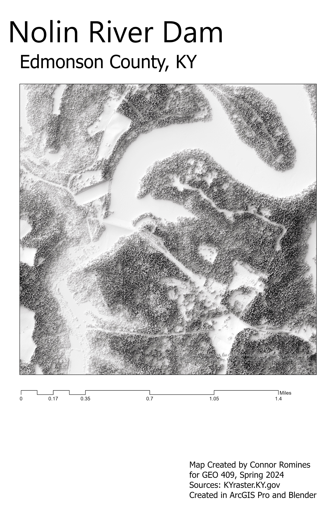

# The Nolin River Dam
## Edmonson County, KY

The Nolin River Dam is a flood-control dam located in Central Kentucky. It was authorized in 1938. Its creation spurred a boom in recreation in close proximity to Mammoth Cave, Kentucky's only national park.

     
*Height Map of Dam and surroundings*

[Link to high-resolution version](Layout.pdf)     

Map created by Connor Romines for GEO409, Spring 2024. Data sourced from kyraster.ky.gov and processed in ArcGISPro and Blender